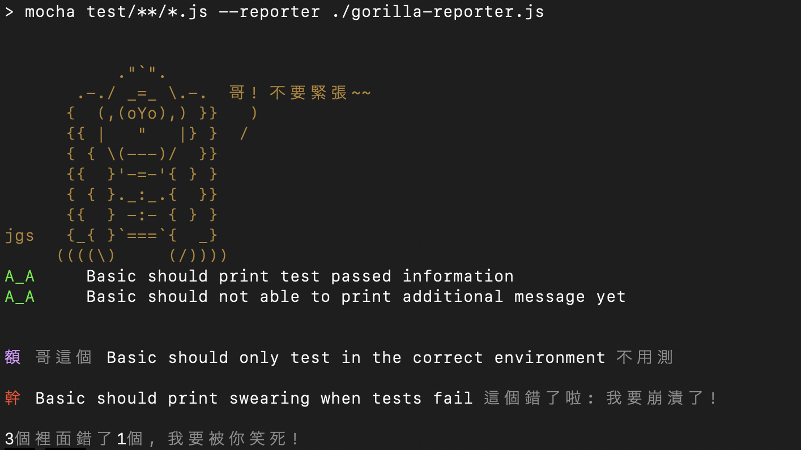

## 猩亞跟你說

A mocha reporter which just sounds like 猩亞.


#### WARNING: Use it at your own risk


### How to use it

Use it like a regular [mocha reporter](https://mochajs.org/#reporters).


### If you want to developt it
1. Clone it and run npm install
```sh
npm install
```

2. Write your code

3. Run test
```sh
npm run test
```

4. Make your code prettier before commit
```sh
npm run precommit
```

### Note
All ASCII arts are copied from https://www.asciiart.eu. Thanks to the author of them. I don't own these stuffs.
